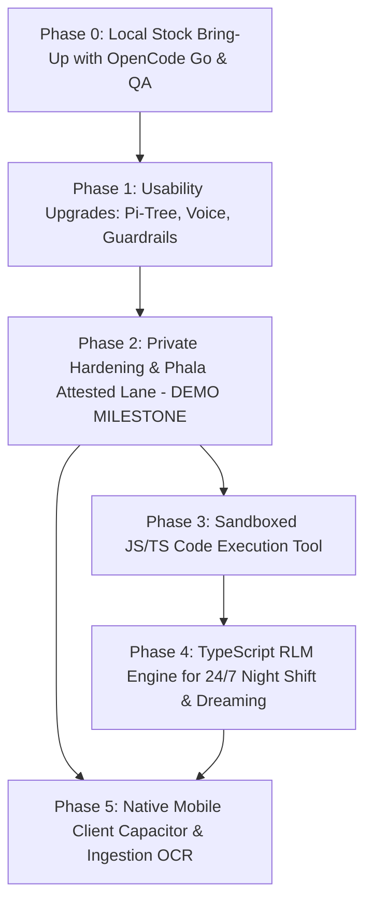

# Private Deployment Roadmap: Mike OSS Fork

Phased implementation roadmap for running Mike as a firm-owned, private AI
platform with confidential TEE inference, local DGX compute, a Pi-style
branching conversation model, local voice, sandboxed code execution, and a
24/7 Recursive Language Model (RLM) engine.

Verified against `main` at `9a0a0a5` (2026-10-07).

---

## 1. Guiding Strategy

1. **Crawl, Walk, Run**: Prove stock Mike locally first before altering the
   engine.
2. **TypeScript-Native**: Because Mike’s entire backend and domain model is in
   TypeScript (`backend/src/modules/*`), sandboxed code execution and RLM
   engines should be built in **JavaScript/TypeScript (Bun / isolated VM)**,
   not Python. This allows the REPL to import Mike's existing compiled domain
   modules directly without dual-language maintenance.
3. **Hardware Economics (The 24/7 Night Shift)**: On owned compute (DGX Spark)
   and confidential TEEs, tokens have near-zero marginal cost. The RLM harness
   unlocks overnight recursive due diligence, speculative redlining, and memory
   "dreaming" while lawyers sleep.

---

## 2. Phase-by-Phase Roadmap

---

### Phase 0: Local Stock Bring-Up & Baseline QA
*Goal: Stand up stock Mike locally on macOS using Docker Compose and OpenCode Go
for inference; verify all baseline legal features.*

* **Local Compose Stack**: Boot `docker-compose.yml` (Postgres, GoTrue Auth,
  PostgREST, RustFS S3, Redis, Mailpit, Backend, Frontend).
* **Inference via OpenCode Go**:
  * Set `OPENCODE_GO_API_KEY` in `backend/.env`.
  * Mike natively supports OpenCode Go models in `backend/src/lib/llm/models.ts`
    (`glm-5.2`, `glm-5.3`, `kimi-k2.6`, `deepseek-v4-pro`, `qwen3.8-max`).
* **Manual QA Verification**:
  1. User signup and login via local GoTrue + Mailpit.
  2. Create a matter Project and upload PDF/DOCX contracts.
  3. Interactive chat: test `read_document` and `find_in_document`.
  4. Redlining: test `edit_document` and verify Accept/Reject cards in the UI.
  5. Document generation: test `generate_docx` and `generate_excel`.
  6. Tabular review: run an extraction matrix over a multi-contract set.

---

### Phase 1: Core Usability & Modularity Upgrades
*Goal: Fix conversational rigidity, add voice dictation/playback, expose loop
depth, and add active injection defense.*

* **1.1. Pi-Style Conversation Tree (Branching & Regeneration)**:
  * Migration: add `parent_message_id uuid references chat_messages(id)` to
    `chat_messages` and `chat_leaf_state (chat_id, user_id, leaf_message_id)`.
  * Backfill: map assistant parents from existing `memory_input_message_id`;
    map user parents from preceding assistant `created_at`.
  * Backend: change context building in `chat.prepare.ts` to be
    server-authoritative (walk tree upward from requested leaf ID; stop relying
    on unvalidated client-supplied history arrays).
  * Frontend: add "Edit and branch" to `UserMessage.tsx`, "Regenerate" to
    `AssistantMessage.tsx`, and sibling switcher controls (`< 2 of 3 >`) to
    `ChatView.tsx`.
* **1.2. Local Audio STT & TTS**:
  * Backend: add `backend/src/modules/audio/` exposing standard OpenAI-compatible
    proxies `POST /audio/transcriptions` (multipart audio) and
    `POST /audio/speech` (streamed audio). Ephemeral in-memory handling; zero
    disk retention.
  * Frontend: add microphone dictation to `ChatInput.tsx` (appends text to
    editable draft; never auto-submits); add sentence-streamed speech playback
    controls to `AssistantMessage.tsx`.
* **1.3. Configurable Tool Iteration Ceiling**:
  * Replace hardcoded `DEFAULT_MAX_ITERATIONS = 16` in `aiSdk.ts` and
    `streaming.ts:515` with `envInt("LLM_MAX_TOOL_ITERATIONS", 32)`.
* **1.4. Active Guardrails & Auto-Mode Policy (Jev Integration)**:
  * Add `backend/src/lib/guardrails/jev.ts` calling a fast Jev classifier.
  * Inspect tool outputs (uploaded contract text) before feeding them to
    `toolResults` to flag indirect prompt injection payloads.
  * Dynamic auto-mode risk scoring (`ALLOW / ASK / DENY`) wrapping
    `runToolCalls` in `streaming.ts`.

---

### Phase 2: Private Deployment Hardening & Phala TEE Lane (DEMO MILESTONE)
*Goal: Make privacy enforceable by the server, connect Phala confidential
inference with verified attestation, and stage the full private demo.*

* **2.1. Strict Private Mode (`STRICT_PRIVATE_MODE=true`)**:
  * Startup fail-fast in `runtimeConfig.ts`: refuse boot if Sentry is enabled or
    hosted keys are present.
  * Catalog lockdown: gate `models.service.ts` and `ModelToggle.tsx` to hide
    hosted providers; reject unapproved models in `routerModels.ts:64`.
  * Utility model protection: re-point `DEFAULT_TITLE_MODEL` and
    `DEFAULT_MAIN_MODEL` to approved local/attested endpoints.
  * SSO-only lockdown: add `SSO_ONLY=true`; disable password registration and
    unmanaged social logins in `auth.routes.ts:117-239`.
* **2.2. Phala Attested Lane**:
  * Add `backend/src/lib/llm/attestation/` with a vendor-neutral verifier.
  * In `providers.ts:222`, wrap `createConfiguredAdapter` with the attestation
    verifier for `trust: "attested"` models. Fail closed on verification fault.
  * Create `inference_receipts` table: record cryptographic measurement,
    verifier version, endpoint ID, and turn ID. Zero prompt/output text stored.
* **2.3. DGX Spark vLLM Integration**:
  * Configure local DGX vLLM endpoints via `MIKE_MODEL_CONFIG_JSON` with
    `location: "local"`, `trust: "local"`.
* **2.4. Demonstration Milestone**:
  * Full end-to-end demo of private matter review running over Phala TEE and
    DGX compute with branching chat, dictation, and verifiable receipts.

---

### Phase 3: Sandboxed Code Execution Tool
*Goal: Give the agent a secure JS/TS sandbox for financial calculations,
waterfall modeling, and tabular data analysis.*

* **Execution Runtime**: Deploy an isolated execution sandbox (e.g. Bun / Node
  worker sandbox container with resource limits, zero network egress, and a
  mounted temporary filesystem).
* **Tool Schema**: Expose `execute_code` in `toolSchemas.ts` accepting
  TypeScript/JavaScript snippets.
* **Human-in-the-Loop Integration**: Route `execute_code` through Mike's
  existing `connectorApprovals.ts` and `ask_inputs` system when strict
  approval mode is enabled.

---

### Phase 4: TypeScript RLM (Recursive Language Model) Engine for 24/7 Deep Work
*Goal: Achieve Harvey-level M&A diligence parity by exposing Mike's domain
modules into a TypeScript REPL, enabling 24/7 autonomous work.*

* **The Problem Solved**: Eliminates the step ceiling and context window
  saturation. A 5,000-document data room is loaded into the REPL as queryable
  variables; sub-agents return findings to REPL variables; only the Root
  Orchestrator's explicit outputs enter context.
* **TypeScript-Native SDK (`packages/mike-sdk`)**:
  * Expose Mike's existing domain logic as a high-level TS module:
    * `vault`: query, filter, and load matter documents.
    * `workflows`: load markdown playbooks and schemas.
    * `redline`: generate tracked-change Word versions.
    * `citations`: verify exact quotes against source texts.
    * `llm`: spawn bounded parallel sub-agents against DGX vLLM endpoints.
* **The Root Orchestrator Harness**:
  * An asynchronous job runner (`backend/src/jobs/registry.ts: rlm.deep_run`)
    running a stateful Bun/TS REPL.
  * The root model writes TS scripts that slice data rooms, dispatch parallel
    sub-agent waves, filter findings in memory, and generate cited memos.
* **The "Night Shift" Workloads**:
  * **Overnight Diligence**: Exhaustive cross-category review across hundreds of
    agreements.
  * **Adversarial Redline Simulation**: Overnight generation of borrower vs.
    lender redlines comparing incoming drafts against firm precedent.
  * **Memory "Dreaming"**: Autonomous knowledge consolidation running across
    completed matters to extract partner drafting habits into firm playbooks.

---

### Phase 5: Production Mobile Client & Ingestion Scaling
*Goal: Native mobile access via MDM and deep document OCR / hybrid retrieval.*

* **5.1. Native Mobile Client (Capacitor)**:
  * Capacitor wrapper around the web application.
  * Native capabilities: FaceID biometric authentication, microphone capture
    for dictation, background window blurring, and native document share sheets.
  * Security: distribution via enterprise MDM over corporate WireGuard/Tailscale
    VPN. Zero push notifications containing confidential text.
* **5.2. Ingestion & Retrieval Scaling**:
  * OCR fallback in `uploads.processing.ts:657-777` for scanned PDFs below a
    text-density threshold.
  * Enable `pgvector`; chunk documents into `document_chunks`; implement
    permission-aware hybrid retrieval (BM25 + vector RRF) in
    `backend/src/modules/retrieval/`.
