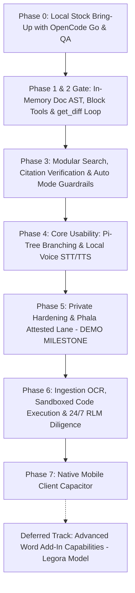

> **Deprecated (2026-10-07).** This roadmap describes the Station 1 block tools (`lib/docxAST.ts`, `read_blocks`, `insert_block`, `delete_blocks`, `replace_block`, `delete_empty_blocks`). They were removed in favor of the Mission 1a document model (`backend/src/lib/docx/`), and other station claims here are overstated. See [`goals/STATUS.md`](../goals/STATUS.md) for current state and order of work.

# Private Deployment Roadmap: Mike OSS Fork

Phased implementation roadmap for running Mike as a firm-owned, private AI
platform with confidential TEE inference, local DGX compute, a Pi-style
branching conversation model, local voice, Auto Mode guardrails, sandboxed code
execution, and a 24/7 Recursive Language Model (RLM) engine.

Verified against `main` (October 2026). Incorporates findings from the
multi-agent consensus review (Claude Opus, Codex, GPT-6.1 Sol, GPT-6 Luna,
Gemini 3.8 Flash, GLM 5.3 Flash) and coding agent Auto Mode security patterns.

---

## 1. Guiding Strategy & Architectural Reset

1. **Crawl, Walk, Run**: Prove stock Mike locally first on Docker Compose before
   altering core runtime engines or schemas.
2. **TypeScript-Native**: Because Mike’s entire backend and domain model is in
   TypeScript (`backend/src/modules/*`), sandboxed code execution and RLM
   engines are built in **JavaScript/TypeScript (Bun / isolated VM)**, not
   Python. This allows the REPL to import Mike's existing compiled domain
   modules directly without dual-language maintenance.
3. **Hardware Economics (The 24/7 Night Shift)**: On owned compute (DGX Spark)
   and confidential TEEs, tokens have near-zero marginal cost. The RLM harness
   unlocks overnight recursive due diligence, speculative redlining, and memory
   "dreaming" while lawyers sleep.
4. **Auto Mode & The Autonomy Spectrum**: Current Mike suffers from approval
   friction: every connector write and document edit is flagged `pending` and
   demands manual human clicks. While a cautious "Human-in-the-Loop" posture is
   appropriate for some legal clients, engineers and autonomous overnight RLM
   tasks require **Auto Mode**. We implement an intelligent, multi-tiered
   permission engine (Jev / System 1 model) that evaluates tool calls dynamically
   into `ALLOW`, `ASK`, or `DENY`.

### What R&D Taught Us About Document Editing
During testing on a 13-page human-authored Word document, Mike's stock document
tool surface (`read_document`, `find_in_document`, `edit_document`) failed
ambiguously:
1. **Fallback Ambiguity**: While `docxTrackedChanges.ts` has `findUniqueAnchor`,
   when surrounding context fails to match, it relaxes constraints and matches
   on lone text if unique anywhere, causing silent wrong-location edits.
2. **Operations That Cannot Be Expressed**: Deleting 60 entries required 60
   separate API calls; newlines inside replacements become soft breaks (`<w:br/>`)
   rather than new paragraphs (`<w:p>`); empty paragraphs cannot be matched or
   removed; edits cannot span paragraph boundaries.
3. **No Self-Verification**: The agent receives a success signal without seeing
   a diff or inspecting whether the file satisfies the prompt.
4. **Partial Batch Failure**: If some edits in a batch succeed while others fail,
   the partial mutations are activated anyway (`documentOps.ts:1376`), violating
   atomicity.

### Industry Findings (Harvey & Legora 2025–2026)
* **Code Mode for Word Documents Failed**: In late 2025, Harvey researched
  Claude's Docx skill (generating Python scripts to edit `.docx` via
  `python-docx`). They abandoned it: it was too slow, degraded legal reasoning,
  and `python-docx` lacks full OOXML support and corrupted document formatting.
  *Conclusion: Keep deterministic code on the server engine; expose high-level,
  fail-closed semantic tools to the model.*
* **Harvey's Current (March 2026) Architecture**:
  1. Parse `.docx` into an in-memory document tree (preservation-first: legal text
     is first-class, while opaque XML nodes pass through untouched).
  2. The agent edits this in-memory representation via focused, iterative tools
     (`read_blocks`, `insert_block`, `delete_blocks`, `replace_block`).
  3. The document updates in memory after every tool call.
  4. The agent **must self-verify** using a `get_diff` tool before finalizing.
  5. Deterministic backend code diffs the working tree against an immutable
     baseline snapshot and compiles native Word tracked changes (`<w:ins>` /
     `<w:del>`) and relationship tables.
* **RLM is for Large-Scale Diligence, Not Micro-Editing**: In September 2026,
  Harvey and Baseten showed that Recursive Language Models (RLMs) load an entire
  5,000-document data room (80M tokens) into a REPL to achieve 96% coverage via
  recursive subagents. RLM is a discovery and diligence harness, not a Word
  patching primitive.
* **Legora's Dual-Domain Model**: Legora separates web drafting (structured
  drafting with live citation provenance) from Word document editing (handled
  inside Microsoft Word via OfficeJS direct DOM manipulation). *Note: Mike
  already has an OfficeJS tracked-change editing path in `wordClientTools.ts`
  and `useWordDoc.ts`; extending this path is deferred while server-side editing
  is stabilized.*

---

## 2. Updated Priority Roadmap



---

### Phase 0: Local Stock Bring-Up & Baseline QA (Completed)
*Goal: Stand up stock Mike locally on macOS using Docker Compose and OpenCode Go
for inference; verify all baseline legal features.*

* **Local Compose Stack**: Boot `docker-compose.yml` (Postgres, GoTrue Auth,
  PostgREST, RustFS S3, Redis, Mailpit, Backend, Frontend).
* **Inference via OpenCode Go**:
  * Set `OPENCODE_GO_API_KEY` in `backend/.env`.
  * Mike natively supports OpenCode Go models in `backend/src/lib/llm/models.ts`
    (`glm-5.2`, `glm-5.3`, `kimi-k2.6`, `deepseek-v4-pro`, `qwen3.8-max`).
* **Manual QA Verification**:
  1. User signup and login via local GoTrue + Mailpit.
  2. Create a matter Project and upload PDF/DOCX contracts.
  3. Interactive chat: test `read_document` and `find_in_document`.
  4. Redlining: test `edit_document` and verify Accept/Reject cards in the UI.
  5. Document generation: test `generate_docx` and `generate_excel`.
  6. Tabular review: run an extraction matrix over a multi-contract set.

---

### Phase 1 & 2: In-Memory Document AST, Block Tools & Self-Verification (Immediate Priority 1)
*Goal: Replace naive flat-string regex substitution with a preservation-first
in-memory document tree, fail-closed atomic block operations, and a model-friendly
`get_diff` verification gate.*

* **1.1. Preservation-First Document Parser (`backend/src/lib/docxAST.ts`)**:
  * Retains the entire Open Packaging Convention (OPC) zip container and opaque
    XML structures (headers, footers, drawings, bookmarks, section properties,
    and styles).
  * Projects body content into a queryable block index:
    * Paragraph blocks (`id`: stable ID derived from `w14:paraId` or sequential hash,
      heading level, style, text content).
    * Table blocks (`id: "tbl_N"`, rows, columns, cells).
    * Footnote blocks (`id: "fn_N"`, citation text, references).
  * Immutable baseline: retains a snapshot of the starting document bytes and hash
    for diff generation and rollback.
* **1.2. Atomic Block-Level Tool Surface (`toolSchemas.ts` & `documentOps.ts`)**:
  * `read_blocks({ start_id, end_id, doc_id })`: Read bounded sections by block ID.
  * `delete_blocks({ start_id, end_id, doc_id })`: Delete entire ranges of
    paragraphs or table rows atomically (e.g., deleting 60 entries cleanly).
  * `delete_empty_blocks({ scope, doc_id })`: Clean up truly empty paragraphs
    (guarded against removing paragraphs that host section breaks or bookmarks).
  * `insert_block({ after_id, content, style, doc_id })`: Insert multi-line
    paragraphs without newline stripping or collapsing into soft breaks.
  * `replace_block({ block_id, new_content, expected_content, doc_id })`:
    Strict fail-closed replacement; rejects immediately if `expected_content` does
    not match (no fallback to loose lone-string matching).
  * **All-or-Nothing Batches**: A batch either applies completely or leaves the
    document untouched.
* **1.3. Deterministic OOXML Compiler & Reversibility Guarantee**:
  * Compiles mutations into native Word tracked changes (`<w:ins>` / `<w:del>`),
    supporting paragraph-mark deletions (`w:pPr/w:rPr/w:del`) and table rows.
  * **Relationship Reversibility**: Hyperlink targets and footnote definitions
    belonging to deleted text MUST NOT be pruned while changes are pending.
    (If a user rejects the deletion in Word, the link/footnote must remain intact).
  * Records individual `del_w_id` / `ins_w_id` so the existing Word Add-in and Web
    Accept/Reject cards continue to function seamlessly.
* **1.4. Self-Verification Loop (`get_diff`) & Invariant Linter**:
  * Expose `get_diff({ doc_id })` returning a model-friendly structured diff.
  * System prompt enforces that the agent calls `get_diff` and checks its own work
    against user intent before declaring completion.
  * Server-side invariant linter:
    * Validates package XML integrity.
    * Exempts standard Word separators (`w:separator`, `w:continuationSeparator`
      with IDs `-1` and `0`) from orphan footnote checks.
    * Flags unreferenced new relationships or dangling bookmark references.

---

### Phase 3: Modular Search, Citation Verification & Auto Mode Guardrails (Priority 2)
*Goal: Provide robust, multi-provider web search and web fetch with strict
egress controls, extend citation verification, and implement coding agent Auto
Mode with System 1 guardrails.*

* **3.1. Outbound Egress Policy & SSRF Guard (`backend/src/lib/search/egress.ts`)**:
  * Enforce allowed egress domains, SSRF protection via `backend/src/lib/privateIp.ts`,
    connection-time DNS validation, and payload size limits.
  * Under `STRICT_PRIVATE_MODE=true`, disable external search unless an approved
    on-premise or confidential gateway is explicitly configured.
* **3.2. Modular Search Provider Engine (`backend/src/lib/search/`)**:
  * Provider-neutral interface:
    * `search(query: string, options: SearchOptions): Promise<SearchResult[]>`
    * `fetchPage(url: string, options?: FetchOptions): Promise<FetchedPage>`
  * **Supported Providers**:
    1. **Keenable** (`https://api.keenable.ai/v1/search`): Primary, agent-first,
       economical, fast structured snippets.
    2. **Tavily** (`https://api.tavily.com`): AI-optimized factual search.
    3. **Exa** (`https://api.exa.ai`): Neural semantic search and clean page contents.
    4. **Parallel** (`https://api.parallel.ai`): High-speed parallel search/extraction.
* **3.3. Extended Citation Verification (`verifyCitations.ts`)**:
  * *Code Reality*: Mike already has `verifyCitations.ts` (447 lines) called by
    `streaming.ts:775`, which checks document page quotes and CourtListener opinions.
  * *Extensions Needed*:
    1. **Web Source Grounding**: Hash and cache fetched web page snapshots, then
       verify quotes against the retained snapshot text.
    2. **Entailment / Hallucination Check**: Fast verifier evaluating whether the
       proposition asserted in the text is logically supported by the quote.
    3. **Unify Verification Pipeline**: Ensure custom citation builders (such as
       tabular review) pass through `verifyCitations` rather than bypassing it.
* **3.4. Coding Agent "Auto Mode" & Guardrails Engine (`backend/src/lib/guardrails/`)**:
  * *The Approval Problem*: Current Mike pauses and waits for manual user approval
    on every write action via `connectorApprovals.ts` and `ask_inputs`. This causes
    approval fatigue and makes autonomous overnight RLM impossible.
  * *Three-Tier Permission Architecture (Claude Code Pattern)*:
    1. **Tier 1 (Safe-Tool Allowlist)**: Read-only actions (`read_document`,
       `read_blocks`, `find_in_document`, `web_search`) execute immediately with
       zero permission friction.
    2. **Tier 2 (In-Session Workspace Actions)**: Benign document mutations,
       scratchpad calculations, and block replacements apply directly in Auto Mode.
    3. **Tier 3 (Transcript Classifier)**: High-blast-radius actions (deleting
       entire document sections, external email dispatch, code execution, RLM
       spawns) pass through the guardrail model.
  * *The Guardrail Classifier Pipeline*:
    * **Development Engine**: Fast classifier via **Jev** (or OpenRouter fast model).
    * **Private Production Engine**: **Self-hosted System 1 model on DGX Spark**
      (e.g., fast quantized 3B–7B Llama/Qwen guardrail model), ensuring zero tokens
      escape to external APIs.
    * **Decision Outputs**:
      * `ALLOW`: Tool executes automatically without user intervention.
      * `ASK`: Tool pauses for human confirmation via `ask_inputs` (in client mode).
      * `DENY`: Action blocked. Uses **Deny-and-Continue** semantics: returns an
        in-band error to the LLM (*"Action blocked by policy: [reason]. Re-evaluate
        and find a safer path"*) so the agent recovers without crashing.
    * **Reasoning-Blind Design**: The classifier sees only the user's prompt and
      the raw toolcall payload; it strips assistant prose and tool outputs to prevent
      the model from rationalizing violations or being tricked by prompt injections.
    * **Input Layer Injection Probe**: Screens uploaded contract text and fetched
      web content to flag indirect prompt injection payloads before they enter context.
* **3.5. Configurable Tool Iteration Ceiling**:
  * Replace hardcoded `DEFAULT_MAX_ITERATIONS = 16` in `aiSdk.ts` and
    `streaming.ts:515` with `envInt("LLM_MAX_TOOL_ITERATIONS", 32)`.

---

### Phase 4: Core Usability Upgrades (Priority 3)
*Goal: Conversational branching and local voice capabilities.*

* **4.1. Pi-Style Conversation Tree (Branching & Regeneration)**:
  * Schema migration: add `parent_message_id uuid references chat_messages(id)`
    to `chat_messages` and `chat_leaf_state (chat_id, user_id, leaf_message_id)`.
  * Server-authoritative context builder: walk the tree upward from active leaf ID.
  * UI: "Edit and branch" on `UserMessage.tsx`, "Regenerate" on
    `AssistantMessage.tsx`, and branch switcher arrows (`< 2 of 3 >`).
* **4.2. Local Audio STT & TTS**:
  * OpenAI-compatible proxies: `POST /audio/transcriptions` (ASR/Whisper) and
    `POST /audio/speech` (TTS).
  * UI composer dictation (microphone appends text to editable draft, never
    auto-submits) and sentence-by-sentence streaming speech playback.

---

### Phase 5: Private Deployment Hardening & Phala TEE Lane (DEMO MILESTONE)
*Goal: Enforceable privacy boundaries, Phala confidential TEE inference, and DGX
Sparks.*

* **5.1. Strict Private Mode (`STRICT_PRIVATE_MODE=true`)**:
  * Refuse startup if Sentry or hosted cloud keys are enabled.
  * Lock down the model catalog to local DGX and Phala endpoints; disable
    unapproved cloud providers and unmanaged signups (`SSO_ONLY=true`).
* **5.2. Phala Attested Lane**:
  * Vendor-neutral attestation verifier checking remote CVM measurements.
  * Record cryptographic `inference_receipts` (measurement, verifier version,
    endpoint ID). Zero prompt or response text recorded.
* **5.3. DGX Spark vLLM Integration**:
  * Connect to local DGX Spark vLLM endpoints via `MIKE_MODEL_CONFIG_JSON`
    over segmented, TLS-secured internal networks.
* **5.4. Full Demonstration Milestone**:
  * Live demo of private matter analysis running on Phala and DGX with branching
    conversations, verified citations, and cryptographic inference receipts.

---

### Phase 6: Ingestion OCR, Sandboxed Code Execution & TypeScript RLM
*Goal: Deep ingestion, secure JS/TS sandboxing, and 24/7 autonomous M&A diligence.*

* **6.1. Ingestion OCR & Hybrid Retrieval**:
  * OCR fallback in `uploads.processing.ts:657-777` for scanned PDF documents.
  * `pgvector` hybrid retrieval (BM25 + vector reciprocal rank fusion) in
    `backend/src/modules/retrieval/` across `document_chunks`.
* **6.2. Sandboxed JS/TS Code Execution**:
  * Isolated Bun/Node container sandbox with zero network egress for financial
    modeling, spreadsheet calculations, and tabular data transformation.
  * Human-in-the-loop: In client mode, code execution can route through
    `connectorApprovals.ts` / `ask_inputs`; in Auto Mode, it runs within strict
    container resource limits.
* **6.3. TypeScript RLM Engine for the "Night Shift" (Full Autonomy)**:
  * Asynchronous background job runner (`backend/src/jobs/registry.ts: rlm.deep_run`).
  * **Full Autonomy Invariant**: The Night Shift operates overnight while lawyers
    sleep; it **never pauses on `ask_inputs`**. It is constrained entirely by
    sandbox isolation, copy-on-write data room boundaries, and the System 1
    guardrail model.
  * A root orchestrator model writes TypeScript scripts to load large data rooms
    (up to 80M tokens) as queryable variables in a REPL, dispatching parallel
    subagents to review folders and synthesize comprehensive diligence memos.
  * Overnight workloads: deep diligence reviews, adversarial redline simulations,
    and autonomous firm memory consolidation ("dreaming").

---

### Phase 7: Native Mobile Client (Capacitor)
*Goal: Secure mobile access via MDM.*

* **7.1. Native Mobile Client**:
  * Capacitor wrapper with biometric unlock (FaceID), local audio dictation,
    app blurring when backgrounded, and corporate MDM distribution.
  * Zero confidential matter text delivered in push notifications.

---

### Deferred Track: Advanced Word Add-In Capabilities (The Legora Model)
*Status: Deferred for after Phase 7 / client demand (or dual-stream).*
* **Current State**: Mike already includes direct OfficeJS tracked-change editing
  in `wordClientTools.ts` and `word-addin/src/taskpane/hooks/useWordDoc.ts`.
* **Deferred Scope**: Adding advanced multi-document synchronizations or
  heavy client-side AST transformations inside the Word Add-in is deferred until
  requested by a client.

---

## 3. Upstream Contribution Strategy (Clean PR Slices)

To maintain a healthy, mergeable fork and give back to Mike OSS (`open-legal-products/mike`), work is partitioned into clean, self-contained PR branches adhering to Mike's `backend-architecture.md` and layering rules:

```
Upstream PRs (Mike OSS)                     Private Fork (Firm-Owned)
───────────────────────                     ────────────────────────
PR 1: OpenCode Go fixes & models (Merged)   Strict Private Mode & Egress
PR 2: Word Footnotes & Hyperlinks (Merged)  Phala TEE Attestation & Receipts
PR 3: In-Memory Doc AST & Block Tools       DGX Spark vLLM Serving
PR 4: Self-Verification get_diff Tool       24/7 TypeScript RLM REPL
PR 5: Modular Web Search (Keenable/Tavily)  System 1 DGX Guardrails & Auto Mode
PR 6: Extended Web Citation Verifier        Enterprise MDM Mobile Shell
PR 7: Configurable Tool Iteration Ceiling
PR 8: Pi-Style Conversation Tree
PR 9: Local STT/TTS Audio Proxies
```

### Upstream Candidate PRs:
- **PR 1**: `fix(llm): OpenCode Go session routing metadata and catalog sync`
  - *Status*: Merged on local `main`.
- **PR 2**: `feat(tools): native Word footnotes and clickable hyperlinks`
  - *Status*: Merged on local `main` & `feat/docx-footnotes`.
- **PR 3**: `feat(tools): in-memory document AST and atomic block tools`
  - *Scope*: `docxAST.ts` preserving OPC package, block index, fail-closed operations (`read_blocks`, `delete_blocks`, `insert_block`, `replace_block`), and atomic batch execution.
- **PR 4**: `feat(tools): get_diff self-verification and invariant linter`
  - *Scope*: Structured diff tool, agent self-review prompt loop, and package-level invariant validation.
- **PR 5**: `feat(tools): provider-agnostic modular web search (Keenable, Tavily, Exa, Parallel)`
  - *Scope*: `backend/src/lib/search/` interface, SSRF protection, Keenable primary adapter, and settings.
- **PR 6**: `feat(citations): web source grounding and entailment verification`
  - *Scope*: Extend `verifyCitations.ts` to cache and verify web snapshots and claim entailment.
- **PR 7**: `feat(llm): configurable tool iteration ceiling`
  - *Scope*: `LLM_MAX_TOOL_ITERATIONS` environment variable replacing hardcoded 16.
- **PR 8**: `feat(chat): immutable conversation tree and branching UI`
  - *Scope*: Schema migration for `parent_message_id`, leaf pointer, server-authoritative context builder, and frontend sibling navigation.
- **PR 9**: `feat(audio): local STT transcription and TTS read-aloud proxies`
  - *Scope*: Standard OpenAI-compatible `/audio/transcriptions` and `/audio/speech` endpoints with UI composer dictation and sentence playback.

### Private Fork Only (Not Upstreamed):
- **Phala TEE Cryptographic Lane**: Remote attestation verification and `inference_receipts` auditing table.
- **Strict Private Mode (`STRICT_PRIVATE_MODE=true`)**: Hard network egress lockouts, disabling telemetry, unapproved BYOK, and external cloud models.
- **System 1 Auto Mode Guardrails Engine**: Local DGX classifier for dynamic `ALLOW / ASK / DENY` toolcall permissions and indirect prompt injection defense.
- **The 24/7 TypeScript RLM REPL Engine**: Overnight autonomous due diligence, speculative redline simulations, and firm memory dreaming on owned DGX compute.
- **Enterprise MDM Mobile Packaging**: Capacitor iOS/Android shell with biometric lock and corporate MDM distribution.
